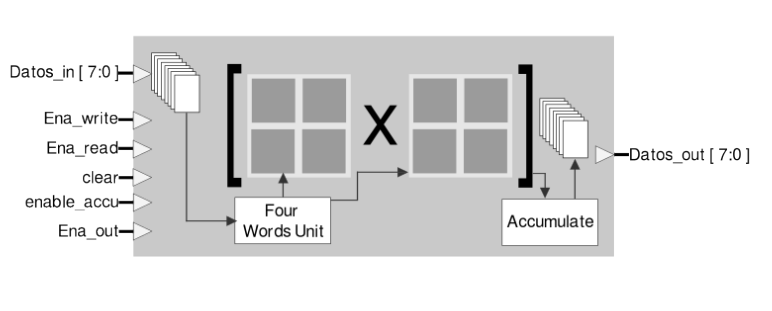

<!---

This file is used to generate your project datasheet. Please fill in the information below and delete any unused
sections.

You can also include images in this folder and reference them in the markdown. Each image must be less than
512 kb in size, and the combined size of all images must be less than 1 MB.
-->

## How it works
In computing, the multiply-accumulate (MAC) operation is a common function that calculates the product of two numbers and adds that product to an accumulator. This operation can be represented by the following equation:

```math
a_{next} <= a + (b*c)  \quad (1)
```

Modern computers often include a dedicated MAC unit, which consists of a multiplier implemented in combinational logic, followed by an adder and an accumulator register that stores the result. The output of the register is fed back into one input of the adder. As a result, on each clock cycle, the output of the multiplier is added to the register.

Inspired by Aleksandar Kostovic's Matrix-MAC Unit [1], we develop our own unit for future neural network applications, capable of solving a 2x2 matrix with 4 bits in each space.

## How to test

Use a 10 MHz clock signal, which iterates over 4-bit binary input values (i_I_cor) combined with 3-bit selection signals (select), and for each combination performs a reset cycle, applies the input value, and waits for a specific number of clock cycles (between 16 and 610 depending on the phase) to verify the circuit's behavior under different operational configurations.


## External hardware
Personal Computer

## Bibliography 
[1] AleksandarKostovic. (2019). Matrix-MAC-Unit: Matrix Multiply and Accumulate unit written in System Verilog [Codice software]. GitHub. Recuperato il 8 settembre 2025, da https://github.com/AleksandarKostovic/Matrix-MAC-Unit
